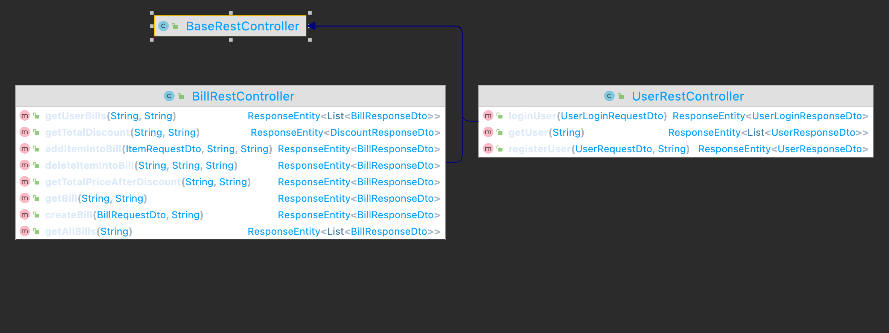
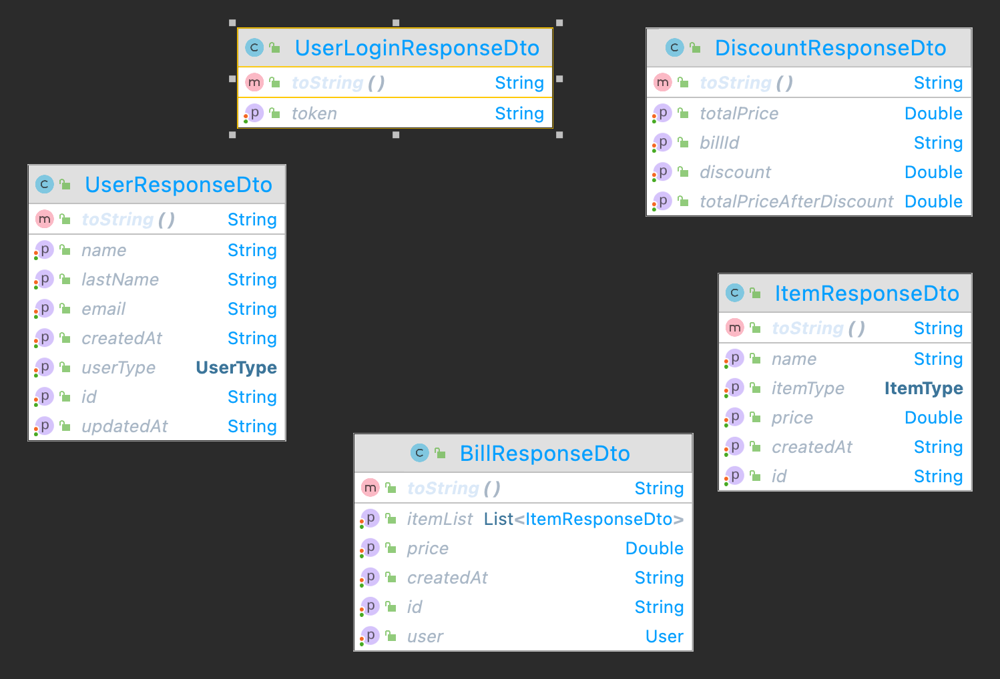

# RetailStore Application
### Design
In this project I have followed the hexagonal architecture rules. I divided my project into `application` and `domain` parts.

`Application` layer consists inbound and outbound connections of application as stated on Hexagonal architecture definition, leaving the User Interface and Infrastructure layers outside. You can find resources worth reading in References below. 

In my project, the rest apis are under /application/adapters/in/rest/controller package. These are entrance point of application: `BillRestController` and `UserRestController`. When a request is received to controller, it forward the object to facade object. Facade objects responsible to convert DTOs to Entities and vice versa. Additionally they triggers the business logic. Facade objects are connection point between application layer and domain layer. To do this, domain layer defines an interface `BillManagementService` and `UserManagementService`.

Regarding to hexagonal architecture, the interfaces are called as Ports. Facade objects uses these interface to run business logic.

The most important rule for `domain layer` is to make it independent from infrastructures, tools, outer services. Everything that is required for business logic should be abstracted. So it ensured this rule using `Port` interface. The implementation of this interfaces are under application layer. This means that `domain layer` doens't know anything about database, REST etc. 

Here, the dependency inversion principle helps us to couple software modules loosely. High-level modules should not import anything from low-level modules (as concrete class); they should both depend on abstractions.

Rest calls' logs are handled with spring aop. See `LoggingAspect.java` in project.

### Build & Run
I have developed this project using Intellij however you are not dependant to this ide. Build environment is maven. In addition, I have added a build script: `build.sh`. This script build project, delete docker container and docker image and build docker image again.
To run `build.sh` docker deamon should be run. 

There exists also a docker compose file under project structure. Inside docker compose, mongodb, mongo express and retailstore services are located. When you run this file with `docker-compsose up`, every required images will be downloaded from docker hub, including retailstore service.

You can check mongo data from [http://localhost:8081](http://localhost:8081) using mongo express tool. 

If you want to run application as docker container, you need to run this command:

`docker run --name retailstore --network=backend-network --restart=unless-stopped -p 8090:8090 -e MONGODB_IP=mongodb -e MONGODB_USER=root -e MONGODB_PASSWORD=passw0rd ilkayaktas/retailstore`

In this project, mongodb data are saved under `mongo/data` folder. If you want to start with a clean database, all you need to do is to delete data folder.

You can find postman collection and postman environment under project structure. I have implemented all scenarios in this collection. Also swagger ui is implemented int his project. Go to [http://localhost:8090/swagger-ui/index.html](http://localhost:8090/swagger-ui/index.html) and see the swagger ui.

Available rest endpoints and DTO's can be read from swagger ui.

### Security
Spring security plays important role in this project. Almost all rest endpoints are secured with tokens. Only login end point doesn't require any token.

I decided to seperated users by type:
- ADMIN
- EMPLOYEE
- AFFILIATE
- CUSTOMER

At the begining, an admin user is created with pasword  `pasw0rd123`. To use apis, this user should be logged in and JWT should be received. Other user types are created to calculate discount. If any other user try to use these end points, `UnauthorizedOperationException` would be detected and operation doesn't permit. 

I have implemented SonarCube code analyses in this project. Results can be visible on this link: [https://sonarcloud.io/project/overview?id=ilkayaktas_RetailStoreAssignment](https://sonarcloud.io/project/overview?id=ilkayaktas_RetailStoreAssignment) 

There is a security issue. The warning is related to CSRF protection. Because this project is not deployed in a real system and I have time limitation, i didn't spend time here.

### Test
I have created unit test and additionally integration test. Unit tests doesn't require Spring context but integration test requires.
You can distinguish integration test class from their name. To run all test together, all spring context is invoked and run test. 
**To do this, mongodb should be running.** Even embedded mongodb is an option, I didn't prefer to use embedded mongodb because of time constraints.
Additionally, environment variables are required to run test. Run below command:

`mvn -DMONGODB_IP=localhost -DMONGODB_USER=root -DMONGODB_PASSWORD=passw0rd test`

### Coverage Report
Test coverage report is generated by Intellij IDEA and put under report folder.

### Class diagrams
#### Rest Controller

#### Request DTO

#### Response Dto

#### Facade Objects

#### Mongo Repository

#### Service Implementation

#### Entity 

#### Enums

### References
[Hexagonal Architecture: three principles and an implementation example](https://blog.octo.com/hexagonal-architecture-three-principles-and-an-implementation-example/)

[DDD, Hexagonal, Onion, Clean, CQRS, … How I put it all together](https://herbertograca.com/2017/11/16/explicit-architecture-01-ddd-hexagonal-onion-clean-cqrs-how-i-put-it-all-together/)